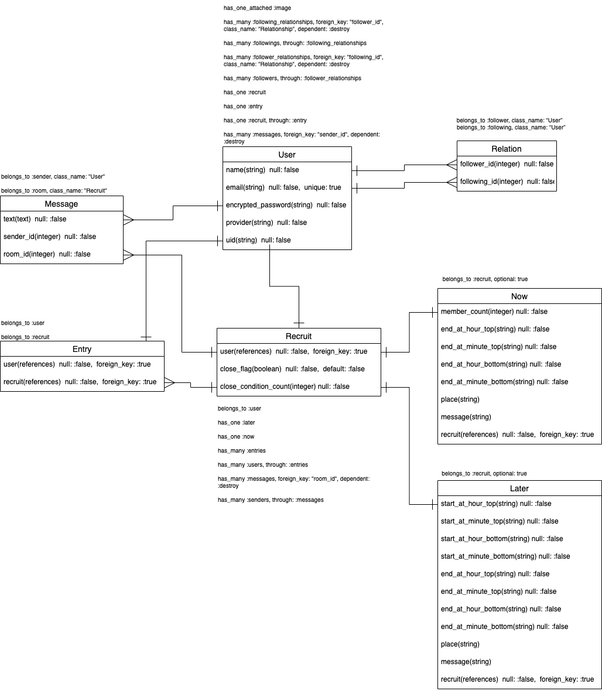

# instakt (インスタクト)
http://instakt.jp

---

## 簡単なアプリ概要
- 今日突然飲みたくなった者同士をマッチングするアプリです！

- 「これから」飲める人を探したい！「いま」飲んでるから来れる人は来て欲しい！といった募集を作成できます！

- この募集に参加したい！という人は、参加ボタンをポチっとするだけで参加可能！

- 募集作成者と参加者だけが入場できるルームでは非同期通信でメッセージのやり取りができます！

- 募集がフレンドにのみ表示されるので、知らない人が急に参加してくる心配はありません！

| 募集一覧 | メッセージルーム |
| --- | --- |
|  |  |

## コンセプト
- 今日は飲みたい気分だなぁ。
- でも、飲める人を探すためにいろんな人にメッセージを送るのは面倒くさいなぁ。
- しかも急なお誘いするのも気が引けるしなぁ。

そんな想いになったら訪れる場所。  
ここに訪れれば、同じ想いの友人を集い、見つけられる。

「誘う」のではなく、「募集・参加」という形式にすることで、  
”飲む気がない人へのお誘い”というミスマッチをなくし、  
”言葉を選ばなければいけないお断り”という面倒なコミュニケーションが発生することを防ぎます。

## 画面遷移図
<!-- 画面遷移図 -->

## データベース設計

## 機能一覧
### ログイン関連
| 機能名 | 詳細 |
| ------ | ---- |
| SNS認証のログイン | Googleアカウントで認証し新規登録orログインし、募集一覧ページに遷移する。 |
| ログアウト | ログアウトし、トップページに遷移する。 |

### ユーザー情報関連
| 機能名 | 詳細 |
| ------ | ---- |
| プロフィール編集 | アイコン、名前、emailを変更できる。(Ajax) |

<!-- 画像orGIFを挿入 -->

### フレンド関連
| 機能名 | 詳細 |
| ------ | ---- |
| フレンド一覧表示 | フレンド一覧を表示する。(Ajax) |
| 申請者一覧表示 | 自分が一方的にハートを付与中のユーザー一覧を表示する。(Ajax) |
| 依頼者一覧表示 | 自分に対して一方的にハートを付与中のユーザー一覧を表示する。(Ajax) |
| ユーザー検索 | IDを入力し、検索すると該当するユーザーを表示する。(Ajax) |
| ハート付与 | ユーザーにハートを付与し、フレンド申請・追加をする。(Ajax) |
| ハート削除 | ユーザーに付与していたハートを解除し、フレンド申請取消・解除をする。(Ajax) |

<!-- 画像orGIFを挿入 -->

### 募集関連
| 機能名 | 詳細 |
| ------ | ---- |
| 募集一覧表示 | 自分とフレンドが作成した募集一覧を表示する。 |
| 募集作成 | 「これから」「いま」それぞれ専用の募集作成フォームを表示し、作成ボタンで募集を作成し、募集一覧ページに遷移する。(フォーム表示はAjax) |
| 募集内容編集 | 「これから」「いま」それぞれ専用の募集編集フォームを表示し、更新ボタンで募集を更新する。(表示も更新もAjax) |
| (任意)募集終了・開始 | 募集を終了or開始する。終了した募集には参加できない。(Ajax) |
| (自動)募集終了 | 募集作成時に設定した募集人数を参加人数が越えると自動で募集を終了する。 |
| (任意)募集削除 | 募集を削除し、募集一覧ページに遷移する。 |
| (自動)募集削除 | AM5:00になると自動で全ての募集を削除する。 |
| 募集内容表示 | (メッセージルームページにて)そのルームの募集内容を表示する。(Ajax) |

<!-- 画像orGIFを挿入 -->

### 参加関連
| 機能名 | 詳細 |
| ------ | ---- |
| 参加 | フレンドが作成した募集に参加し、参加した募集のメッセージルームページに遷移する。 |
| 参加取り消し | 参加を取り消し、募集一覧ページに遷移する。 |
| 参加者リスト表示 | 対象の募集に参加しているユーザー一覧を表示する。(Ajax) |

<!-- 画像orGIFを挿入 -->

### メッセージ関連
| 機能名 | 詳細 |
| ------ | ---- |
| メッセージ作成(画像添付可) | テキストのみor画像のみorテキスト＋画像のメッセージを作成する。(Ajax) |
| 非同期通信 | 相手が作成したメッセージもページ更新なしで自動で表示する。 |

<!-- 画像orGIFを挿入 -->

## 使用言語技術
### バックエンド
- Ruby 2.6.5
- Ruby on Rails 6.0.0

### 使用Gem
- rspec-rails
- factory_bot_rails
- faker
- capistrano
- capistrano-rbenv
- capistrano-bundler
- capistrano-rails
- capistrano3-unicorn
- letter_opener
- unicorn
- devise
- pry-rails
- mini_magick
- image_processing
- active_hash
- aws-sdk-s3
- rails-i18n
- omniauth-google-oauth2
- omniauth-rails_csrf_protection
- whenever

### フロント
- HTML
- CSS
- SCSS
- JavaScript
- JQuery

### データベース
- MySQL

### テスト
- RSpec
- FactoryBot
- Faker

### API
- Google+ API

### ドメイン・DNS
- お名前ドットコム
- AWS Route53

### インフラ
- AWS EC2
- Nginx
- Unicorn
- Capistrano(自動デプロイ)

<!-- インフラ構成図をいれる -->

---

## こだわったポイント
- デザイン
  - 居酒屋のイメージに合わせてベースカラーをオレンジにした。
  - 誰かに説明されなくてもなんとなく使い方が分かるようにと意識した。
- Ajax
  - 募集作成・編集・終了・再開・確認
  - 参加者リスト表示
  - プロフィール編集
  - フレンド表示(申請ユーザー、依頼ユーザー含む)
  - メッセージ作成
  - 上記の機能ではAjaxを使用し、画面読み込み・更新を少なくなるよう意識した。
- ログインを簡単に
  - アカウント管理や入力してログインはユーザーにとってとても面倒なことなので、GoogleアカウントのSNS認証するだけでログインできる仕様にした。
- フレンド追加・解除を簡単に
  - 申請して、承認する。といった煩わしい手続きではなく、ハートをお互いに付与し合ったら「友達」という仕様にした。解除したい場合はハートを消すだけ。
- 募集削除や参加取り消しといった重要アクション時はYES/NOモーダルを表示
  - 操作ミスによる不本意なデータ削除を防ぐようにした。
- 自動で募集終了する機能
  - 参加人数が設定した募集人数を満たすと自動で募集終了となり、それ以上参加できないようにした。
  - これによって、想定以上に参加者が増えることを防いでいる。
- AM5:00には全ての募集を削除するプログラムを定期実行
  - コンセプトは”その日突然飲みたくなった人達が集う場所”なので、前日の募集データは削除する仕様にした。
- メッセージ機能の非同期通信
  - ページ更新しなきゃいけないメッセージのやり取りは絶対に避けたかった。
- Gmailによる通知
  - フレンド申請・追加された時
  - 自分の募集の参加者が増減した時
  - 参加中の募集が削除された時
  - 上記のような重要なタイミングではメール通知がくるようにした。
- アクション毎にフラッシュメッセージを表示
  - ユーザーの操作によって何が起こったのかを分かりやすくした。
---

## 今後の実装機能
- レスポンシブ対応
- バッチ機能(未読のメッセージがあったら赤丸をつける)

---

## URL
http://instakt.jp